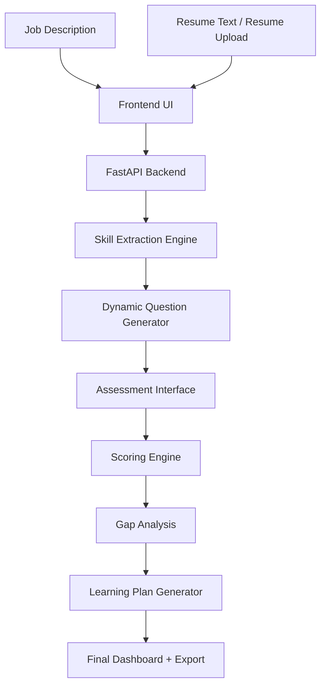

# AI-Powered Skill Assessment & Personalised Learning Plan Agent

A working prototype that evaluates **actual candidate proficiency**, not just resume claims.

This system takes a **Job Description + Resume**, conducts a **skill-based conversational assessment**, scores performance, identifies gaps, and generates a **realistic personalised learning plan**.

---

## 🚀 Features

- Paste Job Description
- Paste or Upload Resume (PDF/TXT)
- Automatic skill extraction from JD & resume
- Dynamic question generation
- Conversational assessment per skill
- Smart scoring using rubric and concept matching
- Job-fit percentage calculation
- Skill gap identification
- Personalized learning roadmap
- Download final report as JSON
- Works without API key using built-in rule-based engine
- Optional AI-ready architecture for OpenAI/Gemini integration

---

## 🛠 Tech Stack

- **Frontend:** React + Vite
- **Backend:** FastAPI
- **Languages:** Python + JavaScript
- **PDF Parsing:** pypdf
- **Deployment:** Render + Vercel

---

## 🧠 Architecture



---

## ⚙️ Scoring Logic

Each skill is scored out of **10**.

```text
Final Score = 40% Resume Evidence + 60% Assessment Answer Quality
```

### Resume Evidence Score

The resume evidence score checks:

- Whether the skill is mentioned in the resume
- Whether related aliases are present
- Whether the candidate has project/action-based proof
- Example action words: built, developed, implemented, deployed, created

### Assessment Answer Score

The assessment score checks:

- Relevant keyword/concept coverage
- Answer length and depth
- Explanation quality
- Practical understanding

### Skill Levels

| Score | Level |
|---|---|
| 8–10 | Strong |
| 6–7 | Intermediate |
| 4–5 | Basic |
| <4 | Gap |

Skills scoring below 7/10 are treated as learning gaps.

---

## 🧪 Why Rule-Based Scoring?

The prototype uses deterministic rubric-based scoring because:

- It works without API keys
- It gives stable demo results
- It avoids random LLM output
- It is fast and reliable for a hackathon prototype

Future improvement: replace or enhance scoring with LLM-based semantic evaluation.

---

## 💻 Local Setup Instructions

### 1. Backend Setup

```bash
cd backend
python -m venv venv
venv\Scripts\activate
pip install -r requirements.txt
uvicorn main:app --reload --port 8000
```

For Mac/Linux:

```bash
cd backend
python3 -m venv venv
source venv/bin/activate
pip install -r requirements.txt
uvicorn main:app --reload --port 8000
```

Backend runs at:

```text
http://localhost:8000
```

---

### 2. Frontend Setup

Open a new terminal:

```bash
cd frontend
npm install
npm run dev
```

Frontend runs at:

```text
http://localhost:5173
```

---

## 🔐 Environment Variables

### Frontend `.env`

Create `frontend/.env`:

```text
VITE_API_URL=http://localhost:8000
```

### Backend `.env` Optional

Create `backend/.env` only if using an AI API:

```text
OPENAI_API_KEY=your_key_here
```

The app works even without `OPENAI_API_KEY`.

---

## 📡 API Endpoints

### Start Assessment using Text Resume

```http
POST /api/start
```

Request:

```json
{
  "jd": "AI Engineer Intern required skills: Python, SQL, Machine Learning, LLM, RAG, Git, REST API, Docker.",
  "resume": "CSE student skilled in Python, SQL, ML projects, REST APIs and Git. Beginner in Docker and RAG."
}
```

Response:

```json
{
  "session_id": "generated-session-id",
  "required_skills": ["docker", "git", "llm", "machine learning", "python", "rest api", "sql"],
  "resume_skills": ["docker", "git", "machine learning", "python", "rest api", "sql"],
  "questions": [
    {
      "skill": "python",
      "question": "How do you handle exceptions in Python?"
    }
  ]
}
```

---

### Start Assessment using Resume Upload

```http
POST /api/start-upload
Content-Type: multipart/form-data
```

Fields:

```text
jd
resume_file
```

Supported file formats:

```text
.pdf
.txt
```

---

### Submit Assessment Answers

```http
POST /api/submit
```

Returns:

- Job-fit percentage
- Skill scores
- Strengths
- Gaps
- Personalized learning plan
- Scoring explanation

---

## 📥 Sample Input

### Sample Job Description

```text
AI Engineer Intern required skills: Python, SQL, Machine Learning, LLM, RAG, Git, REST API, Docker.
The candidate should understand APIs, model evaluation, vector databases, and deployment basics.
```

### Sample Resume

```text
Computer Science student skilled in Python, SQL, machine learning projects, REST API development, and Git.
Built classification models and backend APIs. Beginner-level exposure to Docker and RAG.
```

---

## 📤 Sample Output

```json
{
  "candidate_summary": "Candidate assessed against JD-required skills using resume evidence and conversational answers.",
  "job_fit_percentage": 68,
  "scores": [
    {
      "skill": "python",
      "score": 8,
      "level": "Strong"
    },
    {
      "skill": "docker",
      "score": 6,
      "level": "Intermediate"
    },
    {
      "skill": "rest api",
      "score": 6,
      "level": "Intermediate"
    }
  ],
  "learning_plan": [
    {
      "skill": "docker",
      "current_level": "Intermediate",
      "target_level": "Job-ready intermediate",
      "estimated_time": "2 days",
      "resources": [
        "Docker get started guide",
        "Dockerfile best practices",
        "Containerize one backend app"
      ]
    }
  ]
}
```

---

## 🎥 Demo Video Plan: 3–5 Minutes

Suggested video flow:

1. Introduce the problem:
   - A resume shows what someone claims to know, but not how well they know it.

2. Show the application homepage.

3. Paste a realistic Job Description.

4. Upload or paste a candidate resume.

5. Click **Start Assessment**.

6. Show extracted required skills and resume skills.

7. Answer generated questions for a few skills.

8. Click **Generate Report**.

9. Explain:
   - Job-fit percentage
   - Skill scores
   - Strong areas
   - Skill gaps
   - Personalized learning plan

10. Download the JSON report.

11. Briefly show:
   - README
   - Architecture diagram
   - Scoring logic

---

## 🚀 Deployment Guide

### Backend Deployment on Render

1. Push the project to GitHub.
2. Go to Render.
3. Create a new **Web Service**.
4. Connect the GitHub repository.
5. Use the following settings:

```text
Root Directory: backend
Build Command: pip install -r requirements.txt
Start Command: uvicorn main:app --host 0.0.0.0 --port $PORT
```

6. Deploy.
7. Copy the Render backend URL.

Example:

```text
https://your-backend-name.onrender.com
```

---

### Frontend Deployment on Vercel

1. Go to Vercel.
2. Import the same GitHub repository.
3. Set the root directory as:

```text
frontend
```

4. Add environment variable:

```text
VITE_API_URL=https://your-render-backend-url.onrender.com
```

5. Build settings:

```text
Build Command: npm run build
Output Directory: dist
```

6. Deploy.
7. Open the Vercel frontend URL.

---

## 📁 Project Structure

```text
skill-assessment-agent/
│
├── backend/
│   ├── main.py
│   ├── requirements.txt
│   └── .env.example
│
├── frontend/
│   ├── src/
│   ├── package.json
│   ├── vite.config.js
│   └── .env.example
│
├── samples/
│   ├── sample_jd.txt
│   └── sample_resume.txt
│
└── README.md
```

---

## ✅ Submission Checklist

- Working prototype
- Source code in public GitHub repository
- README with setup instructions
- Architecture diagram
- Scoring and logic explanation
- Sample inputs and outputs
- 3–5 minute demo video
- Deployed frontend/backend or clear local setup instructions

---

## 🔮 Future Improvements

- LLM-based semantic answer evaluation
- More advanced resume parsing
- Difficulty-adaptive questions
- Candidate history tracking
- PDF report export
- Recruiter dashboard
- Role-based benchmark scoring

---

## Final Note

This prototype demonstrates a practical and scalable approach to real skill evaluation using structured assessments, deterministic scoring, and personalized upskilling recommendations.

It is designed for fast hiring evaluation, internship screening, and candidate self-assessment workflows.
