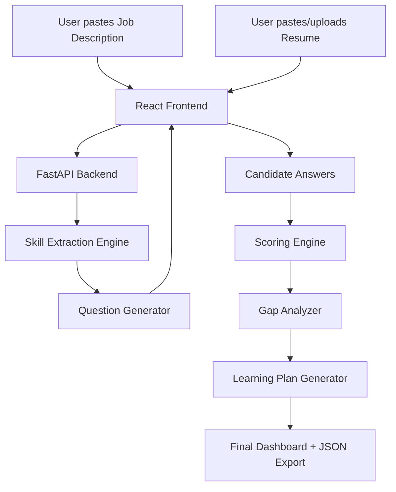

# Architecture Diagram

## Scoring Logic

Final Skill Score is computed from two signals:

- Resume Evidence Score: 40%
- Conversational Assessment Score: 60%

A skill is considered a gap if the final score is below 7/10.

The learning plan focuses on adjacent practical skills that the candidate can realistically acquire quickly through fundamentals, interview-style practice, and a mini project.
